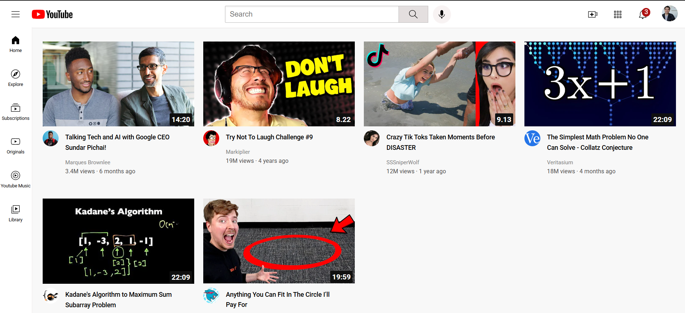

# 🎬 YouTube Clone (HTML & CSS)

A static frontend clone of the YouTube homepage, built using **HTML** and **CSS**.  
This project was created to practice **responsive layouts, Flexbox, and CSS Grid**.

---

## ✨ Features
- Responsive layout for desktop and mobile
- Navigation bar with logo, search, and profile section
- Sidebar with categories
- Video grid layout mimicking YouTube
- Clean and organized CSS structure

---

## 🗂️ Folder Structure
📁 youtube-clone-html-css  
│── 📄 youtube.html – Main HTML file  
│── 📄 style.css – CSS styles  
│── 📁 images – Project images/screenshots  
│── 📄 README.md – Documentation  

---

## 🛠️ Technologies Used
- **HTML5** – Structure  
- **CSS3** – Styling (Flexbox, Grid, Responsive Design)  

---

## ⚙️ How to Run Locally
1. Clone the repository:
   ```bash
   git clone https://github.com/shubhg17/youtube-clone-html-css.git
   
2.Navigate to the project folder:
   ```bash
   cd youtube-clone-html-css
   ```

3.Open **youtube.html** in your browser or run with Live Server in VS Code.

## 📸 Screenshots



## 👨‍💻 Author
- Made by Shubham Ghai
